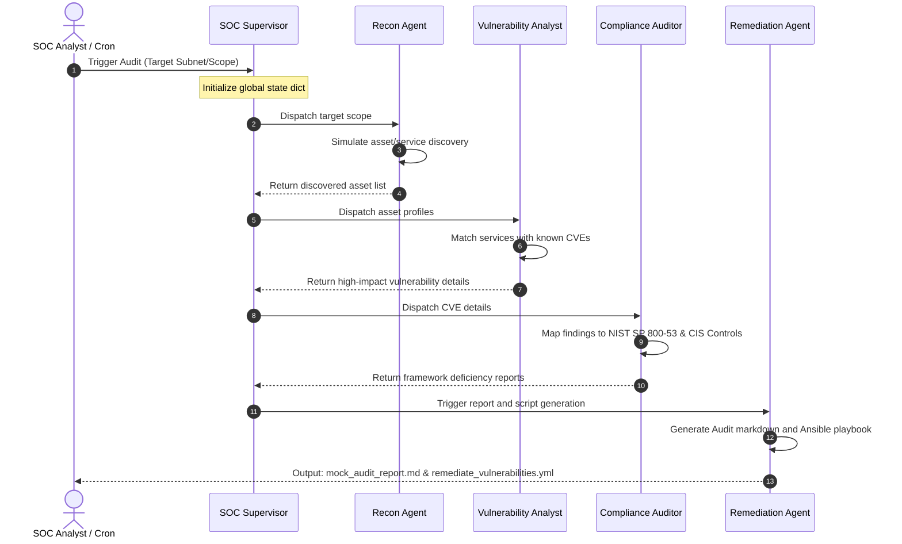

# ASAF-SOC: Agentic Security Audit Framework for SOC

ASAF-SOC is a **Stateful Multi-Agent Simulation Framework** designed to demonstrate how autonomous AI agents can coordinate security audits, map discovered vulnerabilities to compliance frameworks, and generate machine-readable auto-remediation playbooks in a Security Operations Center (SOC) environment.

---

## 🏗️ Architecture & Agent Workflows

The framework is modeled on a decentralized multi-agent coordinator system. A centralized **Supervisor** manages states and triggers modular agent execution lines:



---

## 🛠️ Project Directory Layout

```text
agentic_soc_audit/
├── requirements.txt            # System dependencies (Pydantic, Jinja2, etc.)
├── README.md                   # Project documentation & design specification
├── main.py                     # Command-line entrypoint
└── src/
    ├── __init__.py
    ├── config.py               # Constants, configurations, and print log styles
    └── agents/
        ├── __init__.py
        ├── supervisor.py       # Main state orchestrator
        ├── recon.py            # Reconnaissance & host discovery agent
        ├── vulnerability.py    # Vulnerability & CVE database analyst agent
        ├── compliance.py       # NIST SP 800-53/CIS Controls mapping auditor
        └── remediation.py      # Automated report & Ansible playbook generator
```

---

## 🚀 Getting Started

### Prerequisites
* Python 3.8 or higher.
* No external packages are strictly required for dry-run executions, but production features leverage the specifications in `requirements.txt`.

### Installation & Run

1. Clone or download the directory to your system:
   ```bash
   cd agentic_soc_audit
   ```
2. Run the audit pipeline:
   ```bash
   python main.py
   ```
3. To test with a custom subnet target scope, pass it as a CLI argument:
   ```bash
   python main.py "10.0.5.0/24 (DMZ Zone)"
   ```

---

## 📊 Outputs Generated

Upon completion, the framework outputs the following files in the project root:

1. **`mock_audit_report.md`**: An executive-ready markdown document detailing discovered host criticalities, service structures, CVSS risk ratings, and mapped NIST/CIS/GDPR control gaps.
2. **`remediate_vulnerabilities.yml`**: An Ansible automation playbook containing targeted update configurations to patch detected package flaws (e.g., OpenSSL, PostgreSQL).

---

## 🛡️ Evolving to Production Integration

This framework serves as a design blueprint. To adapt this project to a live production environment:
1. **Agent Execution Isolation**: Containerize each agent using Docker and orchestrate them via **LangGraph** or **Celery** tasks.
2. **Scanner API Integrations**: Replace mock telemetry arrays in `recon.py` and `vulnerability.py` with API calls that query tools like **Wazuh**, **OpenVAS**, **Trivy**, or **Semgrep**.
3. **Local LLM Orchestration**: Deploy a local **Llama-3-70B-Instruct** instance using **vLLM** to securely parse scanning outputs, classify edge-case vulnerabilities, and construct dynamic remediation patches without data leakage.
